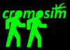

# cromosim — Crowd Motion Simulation



A Python library for simulating pedestrian and crowd dynamics in 2D environments. Implements four families of models — from coarse compartment flows to fully microscopic individual-level physics — all operating on the same spatial domain abstraction.

Based on the numerical methods from:

> Maury, B. & Faure, S. *Crowds in equations: an introduction to the microscopic modeling of crowds*. World Scientific, 2018. Advanced Textbooks in Mathematics.

---

## Theoretical background

Crowd simulation models sit on a spectrum from macroscopic (rooms and flows) to microscopic (individual agents with physics). cromosim covers four points on that spectrum.

### 1. Domain and desired velocities — the Eikonal equation

All models share the same spatial representation. The environment is encoded as a 2D pixel image:

- **Black pixels** — walls (obstacles)
- **Coloured pixels** — destinations (e.g. red = door A, green = door B, white = free space)

For each destination, the library solves the **Eikonal equation** using the Fast-Marching Method (`scikit-fmm`):

```
|∇D| = 1 / f(x)
```

where `D(x)` is the travel time to the destination and `f(x)` is a speed field (uniform by default). The opposite of the normalised gradient `−∇D / |∇D|` gives the **desired velocity field** — the direction each agent should walk to reach the goal in minimum time, automatically routing around obstacles.

Wall distances are computed the same way: the geodesic distance from every free cell to the nearest wall.

### 2. Cellular automaton (module `ca`)

Agents occupy discrete cells on a grid. At each time step every agent probabilistically moves to one of its four neighbours, with weights derived from the desired-velocity field. Conflicts (two agents wanting the same cell) are resolved by sequential or parallel update rules with optional friction. The state is a masked NumPy array (`1` = occupied, `0` = free, masked = wall).

### 3. Follow-the-leader (module `ftl`)

A 1D model for single-file traffic. Each agent's speed is a function `Φ(s)` of the gap `s` to the person ahead:

**Order 1 (kinematic):**
```
dx_i/dt = Φ(x_{i+1} − x_i)
```

**Order 2 (dynamic — with inertia):**
```
dx_i/dt = u_i
du_i/dt = (Φ(x_{i+1} − x_i) − u_i) / τ
```

where `τ` is a relaxation time. Periodic (ring road) and non-periodic (leader-driven convoy) boundary conditions are both supported.

### 4. Microscopic social-force / granular model (module `micro`)

The full 2D individual-based model. Each agent `i` is a disk of radius `r_i` and carries state `(x_i, y_i, r_i, v_i)`. Two sub-models share the same framework:

**Social force model:** repulsion is a soft exponential field:

```
F_ij = −ω_ij · F · exp(−d_ij / δ) + k · [d_ij]₋
```

where `d_ij = |x_i − x_j| − r_i − r_j` is the gap, `[·]₋ = min(·, 0)` handles overlapping, `ω_ij` is a directional weight from the vision-angle correction, and `k` is a stiffness constant. A friction term acts tangentially when agents overlap.

**Granular model:** same framework without the social (long-range) term, so forces are purely contact-based.

After computing desired velocities (from FMM) and social forces, the resulting velocity field must satisfy a **non-overlap constraint**: no two disks may interpenetrate. This is a quadratic programming problem — find the velocity `U` closest to `Vd` such that `B · U ≥ (D − Dmin)/dt`, where `B` is a sparse constraint matrix assembled from contact geometry. Two solvers are available:

- **cvxopt** (default): direct QP solver, fast and exact.
- **Uzawa** (iterative): gradient-ascent on the dual; falls back from cvxopt on failure.

Contacts between agents are found efficiently with a `scipy.spatial.cKDTree` ball-tree query.

### 5. Compartment model (module `comp`)

A network-flow model for large-scale evacuation analysis. Rooms are nodes; doors are edges with a capacity (persons/second). People propagate through the network with travel-time delays:

```
NPir[t] = NPir[t−1] − Flux[t] + Σ_k Flux[t − T_k, upstream_k]
```

No spatial resolution — just counts per room per second. Useful for building-scale evacuation planning.

---

## Repository structure

```
cromosim/
├── cromosim/           # Library package
│   ├── domain.py       # Domain + Destination classes (image I/O, FMM, distances)
│   ├── micro.py        # Microscopic model (contacts, forces, QP projection, sensors)
│   ├── ca.py           # Cellular automaton model
│   ├── ftl.py          # Follow-the-leader model (order 1 & 2)
│   ├── comp.py         # Compartment (network flow) model
│   └── __init__.py
├── examples/
│   ├── domain/         # Domain construction demos (room, stadium, Shibuya crossing)
│   ├── micro/
│   │   ├── social/     # Social force simulations + JSON configs + PNG backgrounds
│   │   └── granular/   # Granular force simulation
│   ├── cellular_automata/
│   ├── follow_the_leader/
│   └── compartments/
├── tests/
│   └── test_domain.py  # pytest test suite
├── doc/                # Sphinx documentation source
├── pyproject.toml      # Package metadata and dependencies
├── requirements.txt    # Direct dependency list for venv setup
└── .x                  # Local dev helper
```

---

## Quick start

**Set up the environment**

```bash
python3 -m venv .venv
.venv/bin/pip install -r requirements.txt
echo "$(pwd)" > "$(.venv/bin/python3 -c 'import site; print(site.getsitepackages()[0])')/cromosim-dev.pth"
```

**Run an example** (microscopic social force, room evacuation):

```bash
cd examples/micro/social
./micro_social.py --json input_room.json
```

**Run the cellular automaton:**

```bash
cd examples/cellular_automata
./cellular_automata.py
```

**Run the follow-the-leader model:**

```bash
cd examples/follow_the_leader
./follow_the_leader.py --json input_ftl_order1_periodic.json
```

**Run the compartment model:**

```bash
cd examples/compartments
./compartments.py
```

> Examples must be run from their own directory — they write output images and results to the current working directory.

---

## Configuration

All examples are driven by JSON files passed with `--json`. No hardcoded parameters. A typical microscopic config specifies:

| Section | What it controls |
|---------|-----------------|
| `domains` | Background PNG, pixel size, wall colors, obstacle shapes, destination colors |
| `people_init` | Groups of agents: count, position box, radius/velocity distributions, initial destination |
| `sensors` | Line segments that measure crossing flows over time |
| `Tf`, `dt` | Simulation end time and time step |
| `F`, `Fwall`, `delta`, `k`, `eta`, `lambda` | Social force / granular force coefficients |
| `projection_method` | `"cvxopt"` (default), `"uzawa"`, or `"mosek"` |

See `examples/micro/social/input_room.json` for a fully annotated example.

---

## Implementation notes

### Spatial domain pipeline

```
PNG image  →  Domain.build_domain()  →  wall_distance (FMM)
                                    →  wall_grad (normalised)
           →  Domain.add_destination()  →  travel_time (FMM)
                                       →  desired_velocity_X/Y
```

The image uses a bottom-left origin in math convention. `numpy.flipud` is applied once in `build_domain()` to convert from PIL's top-left convention — this is load-bearing and must not be removed.

### Agent state

Agents are stored in a single `(N, 4)` float array with columns `[x, y, radius, velocity_coeff]`, conventionally called `xyrv`. Contacts are `(Nc, 5)` arrays `[i, j, d_ij, e_x, e_y]` where `j = −1` denotes a wall contact.

### Constraint matrix

The non-overlap QP requires a sparse matrix `B` of shape `(Nc, 2N)`. Its construction from the contact array is factored into `_build_constraint_matrix(contacts, Nc, Np)` in `micro.py`. The cvxopt path converts this to a cvxopt sparse format; both paths share the same assembly logic.

### Force computation

`compute_forces` is fully vectorised with NumPy. Scatter-add operations use `numpy.add.at` to safely accumulate forces when multiple contacts affect the same agent.

---

## Testing

Tests live in `tests/` and are discovered automatically by pytest.

```bash
.venv/bin/python3 -m pytest tests/ -v
```

Current tests cover `domain.py`:

| Test | What it checks |
|------|---------------|
| `test_create_domain` | Full pipeline: build domain with shapes, FMM wall distances, add destination, verify image shape |
| `test_domain_no_walls_raises` | `RuntimeError` raised (not `sys.exit`) when no wall pixels found |
| `test_domain_str` | `__str__` method is functional |
| `test_destination_str` | `__str__` method is functional |

### What is deliberately not unit-tested

The simulation models (`micro`, `ca`, `ftl`, `comp`) depend on random initialisation, iterative solvers, and matplotlib rendering — they are best validated by running the provided examples and inspecting the output visually or via saved PNGs. The mathematical correctness of the models is validated against the reference book.

---

## Dependencies

| Package | Role |
|---------|------|
| `numpy` | Core array operations, simulation state |
| `scipy` | `cKDTree` for neighbour search, random distributions |
| `Pillow` | PNG image loading and domain rendering |
| `matplotlib` | Visualisation (shapes, quiver plots, animation) |
| `scikit-fmm` | Fast-Marching Method for Eikonal equation |
| `cvxopt` | QP solver for the non-overlap projection step |
| `imageio` | Saving animation frames |
| `pytest` | Test runner |

---

## Authors

Sylvain Faure (CNRS, Univ. Paris-Saclay) and Bertrand Maury (ENS Ulm, Univ. Paris-Saclay).

License: GPL
